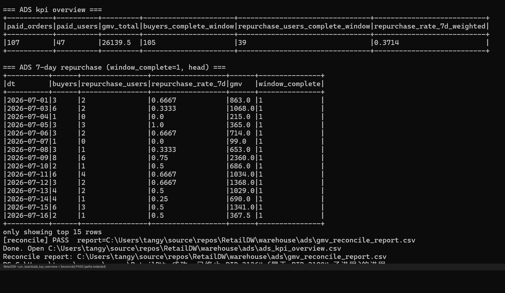
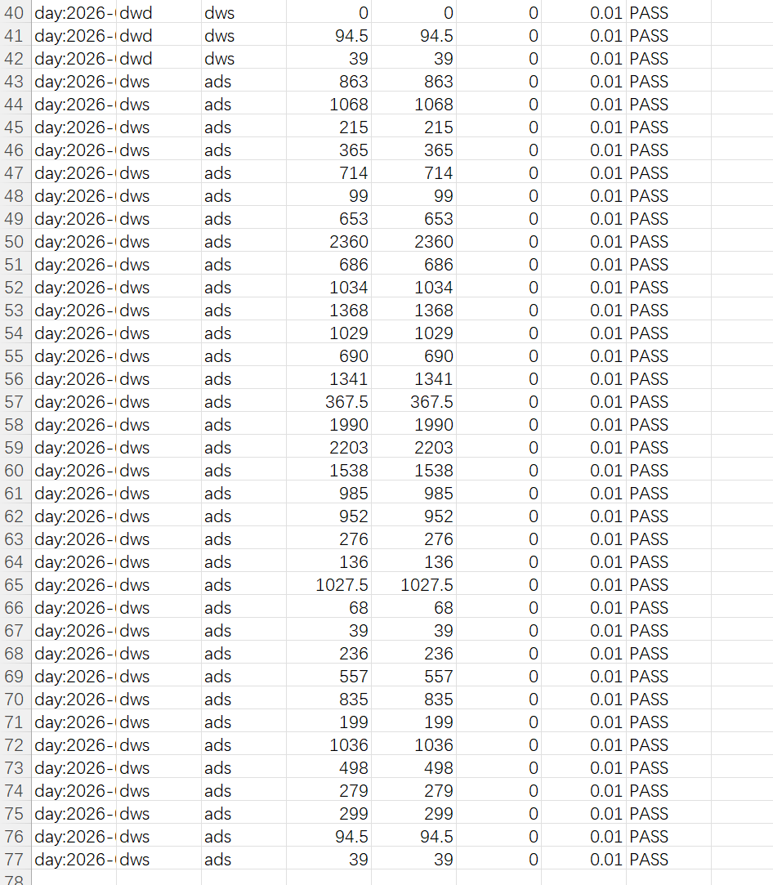

# RetailDW

Local PySpark retail data warehouse demo: **ODS → DWD → DWS → ADS**, with hard quality gates, refund-aware net GMV, dt-partition idempotent re-runs, and DWD/DWS/ADS GMV reconcile.

## Problem

Offline retail order data needs a reproducible layered warehouse that:

- cleans and types source CSVs once (DWD),
- aggregates user-day / category-day summaries (DWS),
- publishes 7-day repurchase rate and net GMV KPIs (ADS),
- fails closed on bad data, and proves GMV consistency across layers.

## Architecture

```
data/ods/*.csv          ODS  source CSVs (synthetic sample)
        │  quality.py   hard gates — fail => exit 2, no DWD write
        ▼
warehouse/dwd/          DWD  facts/dims; is_paid; net_gmv = pay - refund
        ▼
warehouse/dws/          DWS  user×day / category×day (net GMV)
        ▼
warehouse/ads/          ADS  repurchase_7d + kpi overview + reconcile report
```

| Layer | Role |
| --- | --- |
| ODS | Traceable source files |
| DWD | Typed facts; `is_paid` for paid/shipped/completed only (`refunded` is not paid) |
| DWS | Light aggregates used by KPIs |
| ADS | 7-day repurchase + GMV; `gmv_reconcile_report.csv` |

SQL lives in `sql/`; `jobs/pipeline.py` executes it. Optional `--dt YYYY-MM-DD` overwrites only that partition (`partitionOverwriteMode=dynamic`).

**One run (Windows PowerShell):**

```powershell
.\scripts\run_local.ps1
```

**One verification result:** console shows `[quality] ODS gates passed`, ADS KPI overview, and `[reconcile] PASS`; report at `warehouse/ads/gmv_reconcile_report.csv` (DWD ≡ DWS ≡ ADS net GMV, tolerance 0.01).





## Guarantees

1. **Quality gates** (before DWD): PK uniqueness/non-null, enums, non-negative amounts, FKs, parseable `order_ts`/`dt` with `DATE(order_ts)==dt`, line `amount == qty*unit_price` (0.01), order↔item amount and refund checks. Any violation → exit 2.
2. **Refund semantics:** `net_gmv = pay_amount - refund_amount`. `status=refunded` ⇒ `is_paid=0` (does not enter repurchase numerator/denominator); refunds only reduce GMV. Item `net_qty = gross_qty - refund_qty`.
3. **Idempotent dt re-run:** `--dt` parsed via `datetime.date.fromisoformat`; same `--dt` twice leaves that partition identical (format-agnostic fingerprint for parquet/CSV). ADS is rebuilt from all warehouse partitions after a scoped run.
4. **Empty ODS partition:** `--dt` with 0 ODS orders **FAIL** (exit 2) by default; `--allow-empty-partition` overwrites `warehouse/.../dt=<dt>` with empty data identically on Linux parquet and Windows CSV.
5. **GMV reconcile:** DWD paid net GMV ≡ DWS user-day GMV sum ≡ ADS day/total GMV (tolerance 0.01); FAIL → exit 2.
6. **Metrics:** DWS splits `order_cnt` vs `paid_order_cnt`; category qty exposes `gross_qty` / `refund_qty` / `net_qty` (and `qty` = net).
7. **dim_user:** full refresh every run (no SCD2).
8. **Automated tests:** pytest covers quality (FK/amount), refund/repurchase, same-day multi-order, D+1/D+8 windows, incomplete window, idempotency, reconcile, and empty-partition fail/allow.

## Quickstart

**Requirements:** Python 3.9+, JDK 17+ (`java -version`), ~4GB RAM. On Windows, DWD/DWS persist as CSV partition parts (no winutils required).

```bash
git clone https://github.com/tangyf07/RetailDW.git
cd RetailDW

# Linux / macOS
bash scripts/run_local.sh

# Windows PowerShell
.\scripts\run_local.ps1
```

Manual:

```bash
python -m venv .venv
# Windows: .\.venv\Scripts\Activate.ps1
pip install -r requirements.txt
pip install pytest
python jobs/pipeline.py
```

Partition re-run:

```bash
DT=2026-07-13 bash scripts/run_local.sh
# Windows: $env:DT='2026-07-13'; .\scripts\run_local.ps1
python jobs/pipeline.py --dt 2026-07-13
# Empty ODS for that dt fails unless:
python jobs/pipeline.py --dt 2099-01-01 --allow-empty-partition
```

Tests:

```bash
pytest
# Windows: .\.venv\Scripts\python.exe -m pytest
```

Success artifacts:

- `warehouse/ads/ads_kpi_overview.csv`, `warehouse/ads/ads_repurchase_7d.csv`
- `warehouse/ads/gmv_reconcile_report.csv`
- `warehouse/dwd|dws/.../dt=YYYY-MM-DD/` partitions

### Sample data

| Table | Path | Rows (incl. header) |
| --- | --- | --- |
| users | `data/ods/users.csv` | 49 |
| orders | `data/ods/orders.csv` | 124 |
| order_items | `data/ods/order_items.csv` | 189 |

Synthetic via `scripts/gen_sample_data.py` (fixed seed). Regenerate with `python scripts/gen_sample_data.py`.

### Metric (7-day repurchase)

```
buyers(D)     = users with ≥1 paid order on day D (is_paid=1)
repurchase(D) = buyers(D) with another paid order on a day in (D, D+7]
rate(D)       = repurchase(D) / buyers(D)
```

Same calendar day does not count as repurchase. Incomplete windows (`D+7 > max_dt`) set `window_complete=0` and are excluded from the weighted overview rate. GMV uses net amounts.

## Evidence

Local run evidence (paths redacted in screenshots where noted):

| Evidence | File |
| --- | --- |
| Terminal reconcile PASS | [`docs/evidence/reconcile-pass.png`](docs/evidence/reconcile-pass.png) |
| `gmv_reconcile_report` PASS table | [`docs/evidence/gmv_reconcile_report.png`](docs/evidence/gmv_reconcile_report.png) |

CI (GitHub Actions): `.github/workflows/ci.yml` runs `pytest`, then `python jobs/pipeline.py`, then asserts reconcile report is all PASS.

## Limitations

- No Hive / Iceberg / Airflow — local files + Spark SQL only; production would use partitioned tables and a scheduler.
- No SCD2 user dimension — `dwd/dim_user` is **full-refreshed every run** (slice replace, not slowly-changing history).
- Order date from `order_ts`, not a separate payment-callback timestamp.
- Quality gates sit between ODS and DWD only; ADS does not silently drop rows.
- Sample is small by design (laptop-friendly); SQL shape matches larger daily volumes.

## Layout

```
data/ods/                 offline sample CSV
docs/evidence/            reconcile PASS screenshots
docs/interview-notes.md   optional talking points (kept out of README)
jobs/pipeline.py          entry (--dt supported)
jobs/quality.py           quality gates
jobs/reconcile_gmv.py     DWD/DWS/ADS GMV reconcile
sql/                      DWD / DWS / ADS Spark SQL
scripts/run_local.ps1     Windows runner
scripts/run_local.sh      Linux/macOS runner
tests/                    pytest + small fixtures
.github/workflows/ci.yml  pytest → pipeline → reconcile
LICENSE                   MIT
warehouse/                run output (gitignored)
```

## License

MIT — see [LICENSE](LICENSE).
